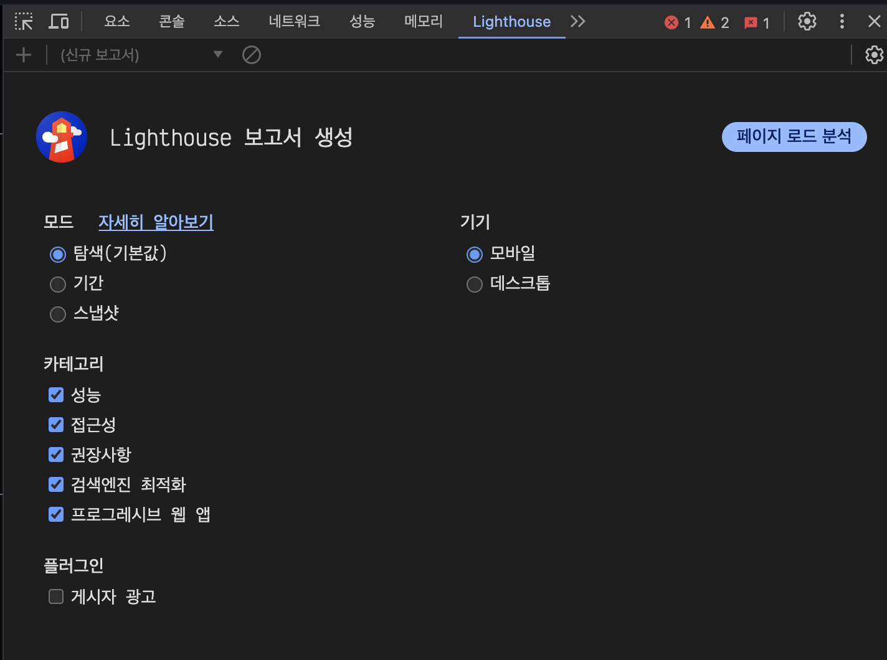
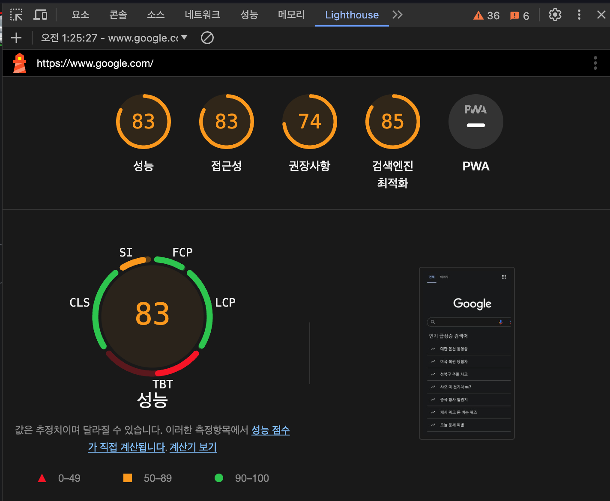
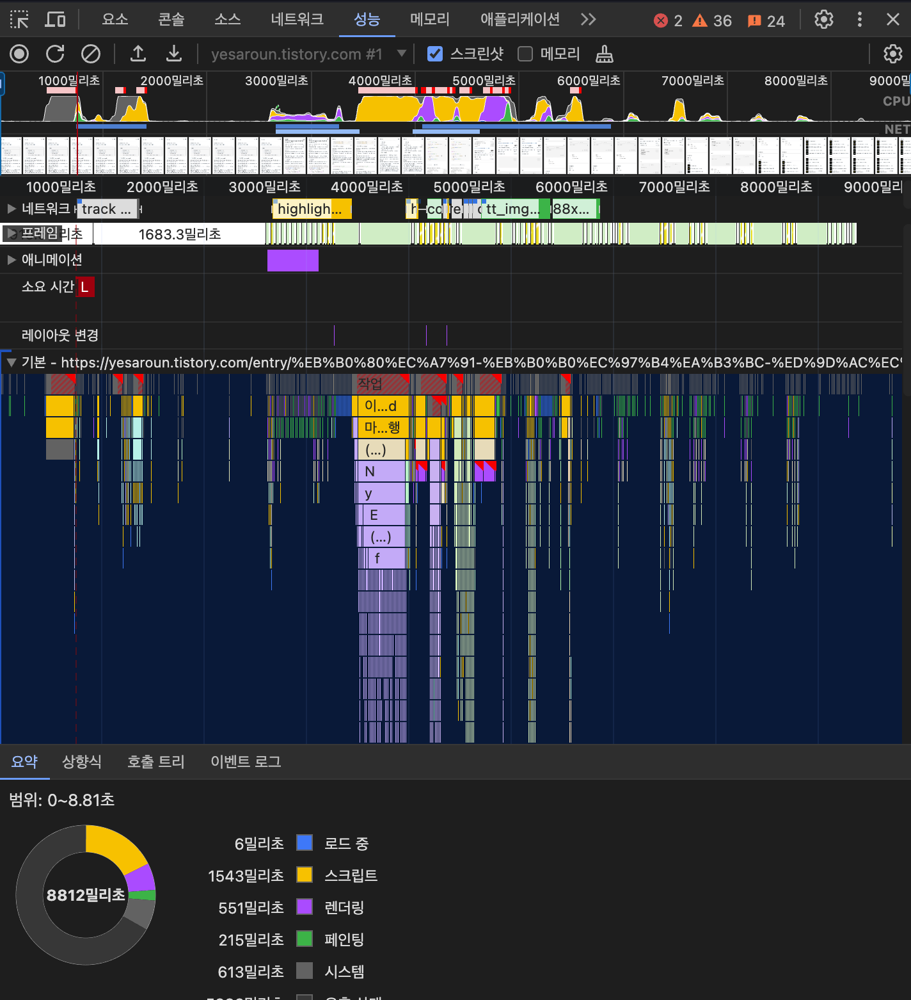
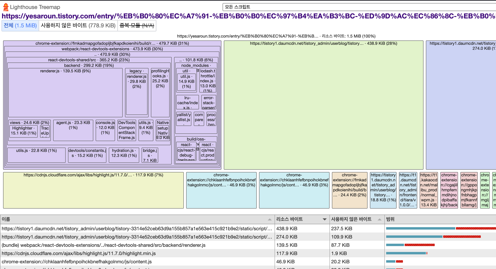
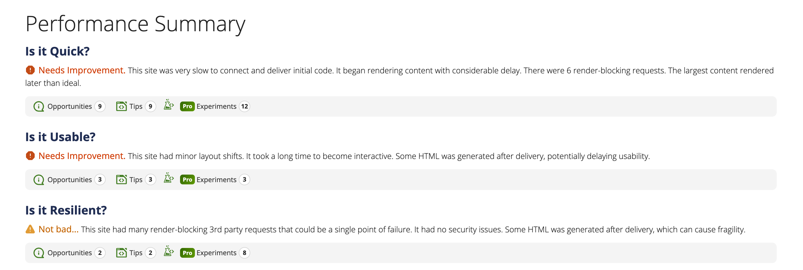
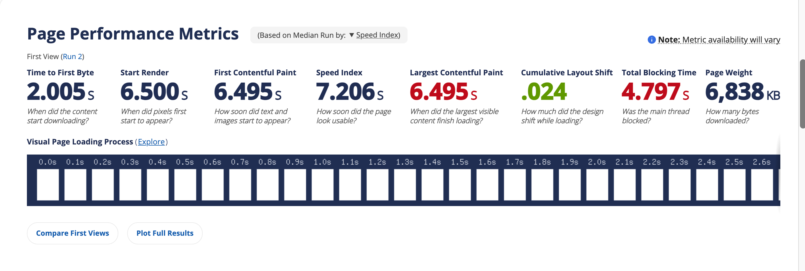
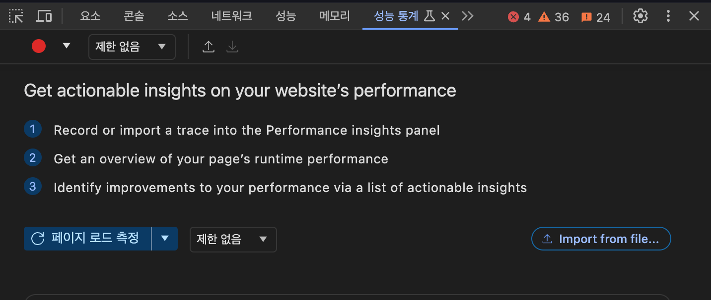
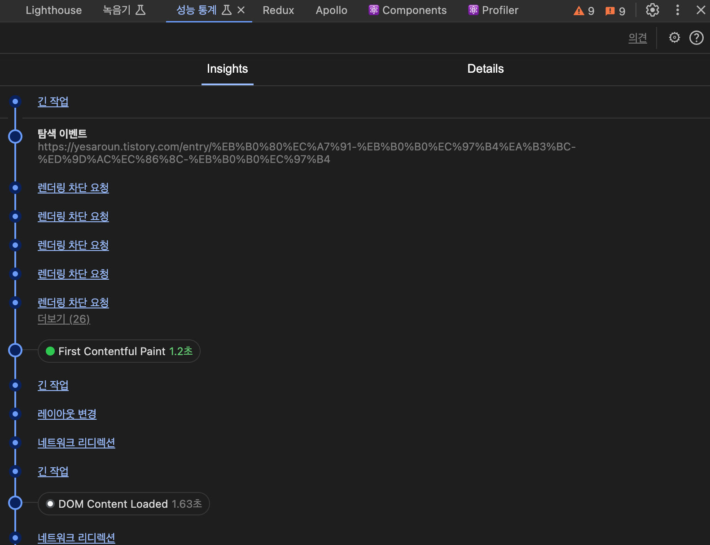
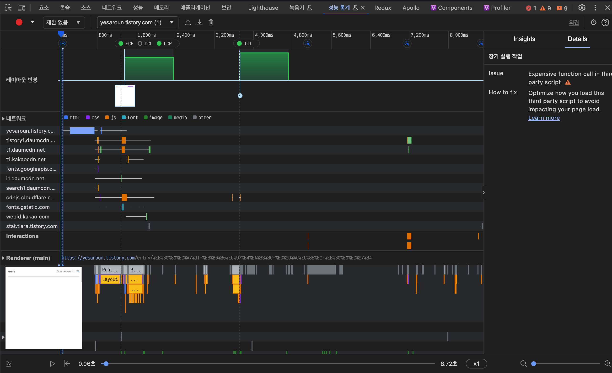

## 13.1 애플리케이션에서 확인하기(p813-828)

### 13.1.1 create-react-app

create-react-app을 통해 프로젝트를 생성하면 아래와 같은 파일이 함께 생성된다.

```tsx
// report WebVitals.ts 
import { ReportHandler } from 'web-vitals'

const reportWebVitals = (onPerfEntry?: ReportHandler) => { 
  if (onPerfEntry && onPerfEntry instanceof Function) {
    import('web-vitals').then(({ getCLS, getFID, getFCP, getLCP, getTTFB }) => {
        getCLS(onPerfEntry) 
        getFID(onPerfEntry) 
        getFCP(onPerfEntry) 
        getLCP(onPerfEntry) 
        getTTFB(onPerfEntry)
    }) 
  }
}

export default reportWebVitals

// ...

// index.tsx
// If you want to start measuring performance in your app, pass a function
// to log results (for example: reportWebVitals(console.log))
// or send to an analytics endpoint. Learn more: https://bit.ly/CRA-vitals 
reportWebVitals()
```

reportWebVitals 함수는 웹에서 성능을 측정하기 위한 함수다.  
이름에서도 알 수 있듯이 각각 누적 레이아웃 이동(CLS), 최초 입력 지연(FID), 최초 콘텐츠풀 페인트(FCP), 최대 콘텐츠 페인팅(LCP), 첫 바이트까지의 시간(TTFB)을 측정하는 용도로 사용된다.  

이러한 지표의 측정을 가능케 하는 것은 바로 web-vitals 라이브러리이다.  
이러한 자바스크립트 수준의 라이브러리가 브라우저의 웹페이지 성능을 측정할 수 있는 이유는 PerformanceObserver라는 API를 사용하기 때문이다.    
PerformanceObserver는 웹페이지에서 다양한 성능을 측정할 수 있도록 도와주는 API로, 브라우저에서 웹페이지의 성능을 측정하기 위해 사용된다.  

### 13.1.2 create-next-app(p816-831)
Next.js에서도 `NextWebVitalsMetric`을 제공한다.  

## 13.2 구글 라이트하우스(p819-834)
리액트 애플리케이션에서 reportWebVitals를 설치해서 지표를 수집하는 방식은 기존 애플리케이션 코드의 수정이 필요하다는 점, 별도로 지표 수집을 하기 위한 사전 준비가 필요하다는 번거로움이 있다.  

반면에 구글 라이트하우스(Google-Lighthouse)는 별도의 애플리케이션 코드 수정이나 배포, 수집 없이도 지표를 수집할 수 있다.  

구글 라이트하우스는 앞서 살펴본 핵심 웹 지표뿐만 아니라 접근성, PWA, SEO 등 웹 페이지를 둘러싼 다양한 요소들을 측정하고 점검할 수 있다.  

크롬의 경우 크롬 개발자 도구를 열어 Lighthouse 탭을 클릭하면 된다.(가급적 시크릿창에가급적 시크릿창에서서)  

  

### 13.2.1 구글 라이트하우스 - 탐색 모드(p821-836)
일반적으로 페이지에 접속했을 때부터 페이지 로딩이 완료될 때까지의 성능을 측정하는 모드다. 이 모드로 측정을 시작하면 페이지를 처음부터 다시 불러와서 페이지 로딩이 끝날 때까지 각각의 지표를 수집한다.



#### 성능(p822-837)
성능은 웹페이지의 성능과 관련된 지표를 확인할 수 있는 영역이다.  

- 최초 콘텐츠풀 페인트(FCP)
- 최대 콘텐츠풀 페인트(LCP)
- 누적 레이아웃 이동(CLS)
- Time toInteractive: 페이지에서 사용자가 완전히 상호작용(인터랙션)할 수 있을 때까지 걸리는 시간을 측정한다.
- Speed Index: 페이지가 로드되는 동안 콘텐츠가 얼마나 빨리 시각적으로표시되는지를 계산한다.
- TotalBlockingTime: 메인스레드에서 특정 시간 이상 실행되는 작업, 즉 긴 작업이 수행될 때마다 메인스레드가 차단된 것으로 간주한다. 용자가 무언가 작업이 진행되고 있지 않다는 것을 눈치 챌 수 있는 시간을 대상으로만 총 차단 시간을 구하게 된다.

#### 접근성(p824-839)
접근성이란 웹 접근성을 말하며, 장애인 및 고령자 등 신체적으로 불편한 사람들이 일반적인 사용자와 동등하게 웹페이지를 이용할 수 있도록 보장하는 것을 말한다.  

#### 권장사항(p825-840)
권장사항 영역에서는 웹사이트를 개발할 때 고려해야 할 요소들을 얼마나 지키고 있는지 확인할 수 있다.  
이 권장사항에는 보안, 표준 모드, 최신 라이브러리, 소스 맵 등 다양한 요소가 포함돼 있다.  

#### 검색 엔진 최적화(p827-842)  
검색엔진 최적화란 웹페이지가 구글과 같은 검색엔진이 쉽게 웹페이지 정보를 가져가서 공개할 수 있도록 최적화돼 있는지를 확인하는 것을 의미한다.  
단순히 문서를 크롤링하기 쉽게 만들었는지 확인하는 것부터, robots.txt가 유효한지, 이미지와 링크에 설명 문자가 존재하는지, `<meta>`나 `<title>` 등으로 페이지의 정보를 빠르게 확인할 수 있는지 등을 확인한다.  

### 13.2.2 구글 라이트하우스 - 기간 모드(p828-843)
기간 모드는 실제 웹페이지를 탐색하는 동안 지표를 측정한다.  

#### 흔적(p829-844)
흔적(View Trace)은 웹 성능을 추적한 기간을 성능 탭에서 보여준다.   

시간의 흐름에 따라 어떻게 웹페이지가 로딩됐는 지를 보여준다.



#### 트리맵(p830-845)
트리맵은 페이지를 불러올 때 함께 로딩한 모든 리소스를 함께 모아서 볼 수 있는 곳이다. 웹페이지의 전체 자바스크립트 리소스 중 어떠한 파일이 전체 데이터 로딩 중 어느 정도를 차지했는지를 비율로 확인할 수 있으며, 실제 불러온 데이터의 크기를 확인할 수도 있다.  



### 13.2.3 구글 라이트하우스 - 스냅샷(p832-847)  

스냅샷 모드는 탐색 모드와 매우 유사하지만 현재 페이지 상태를 기준으로 분석한다는 점이 다르다. 즉, 현재 상태에서 검색엔진의 최적화, 접근성, 성능 등을 분석할 수 있다. 페이지 로딩이 아닌 특정 페이지 특정 상태를 기준으로 분석하고 싶다면 스냅샷 모드를 사용하면 된다.  

## 13.3 WebPageTest(p835-850)

[링크](https://www.webpagetest.org/)

WebPageTest에서 제공하는 분석 도구는 다음과 같다.

- Site Performance: 웹사이트의 성능을 분석을 위한 도구 
- Core Web Vitals: 웹사이트의 핵심 웹 지표를 확인하기 위한 도구
- Lighthouse: 구글 라이트하우스 도구
- Visual Comparison: 2개 이상의 사이트를 동시에 실행해 시간의 흐름에 따른 로딩 과정을 비교하는 도구
- Traceroute: 네트워크 경로를 확인하는 도구

CoreWeb Vitals, Lighthouse의 경우에는 앞에서 언급한 크롬 개발자 도구 등으로 갈음이 가능하다.   

Visual Comparison은 성격이 비슷하나 사이트끼리 비교하는 용도로 사용된다.    

이 책에서는 Site Performance를 주로 다루었다.  

참고로 WebPageTest는 미국, 인도, 독일 등 한국과 거리가 먼 서버를 기준으로 테스트하기 때문에 앞서 크롬 개발자 도구에서 테스트했을 때보다 성능지표가 좋지 않을 가능성이 매우 높다. 글로벌 웹사이트를 지향하는 것이 아니라면 이 점은 염두에 두고 테스트하는 것이 좋다.  

### 13.3.1 Performance Summary(p836-851)
전체적인 결과를 요약해서 볼 수 있다.    

측정 결과 페이지는 크게 세 가지 영역으로 나눠져 있다.  

##### Opportunities & Experiments


- Is it Quick: 웹사이트가 충분히 빠른지를 평가한다. 여기서 빠름을 나타내는 것은 최초 바이트까지의 시간(TTFB)이 짧은지, 콘텐츠 렌더링이 즉각적으로 일어나는지, 최대 콘텐츠풀 페인트(LCP) 시간이 합리적인지를 확인한다.
- Is it Usable: 웹사이트의 사용성과 시각적인 요소를 확인한다. 콘텐츠 누적 이동(CLS)을 최소화하고 있는지, 상호작용을 빠르게 할 수 있는지, 접근성 이슈가 있는지, 클라이언트 사이드에서 과도하게 HTML을 많이 렌더링하는지 등을 점검한다.
- Is it Resilient: 보안 취약성을 점검한다. 렌더링을 블로킹하는 제3자 라이브러리가 존재하는지 실질적인 위협이 되는 보안 위험 요소가 있는지를 나타낸다.  

##### Observed Metrics


최초 바이트까지의 시간 렌더링 시작에 소요되는 시간, 최초 콘텐츠풀 페인트 등 측정할 수 있는 다양한 시간 지표에 대해 나타낸다.   

##### Individual Runs
기본적으로 WebPage Test는 3번의 테스트를 돌려서 평균값을 보여주는데, 각 실행별로 어떠한 결과를 보여주는지 확인할 수 있다.  

## 13.4 크롬 개발자 도구(p853-868)

### 13.4.1 성능 통계

  

Throttling을 사용해 네트워크와 CPU 속도를 지연시킬 수 있다.  

또한 성능 측정에 앞서 반드시 뷰포트를 실제 사용자가 보는 크기만큼 설정해야 한다.  

#### Insights(p854-869)
Insights에서는 성능을 측정하는 기간 동안 발생한 이벤트 중 눈여겨봐야 할 내용을 시간의 흐름에 따라 모아서 보여준다.  

  

#### 메인 메뉴(p859-874)
    
메인 영역에서는 성능을 측정하는 기간 동안 무슨 일이 일어나는지 확인할 수 있는 다양한 기능을 제공한다.  


